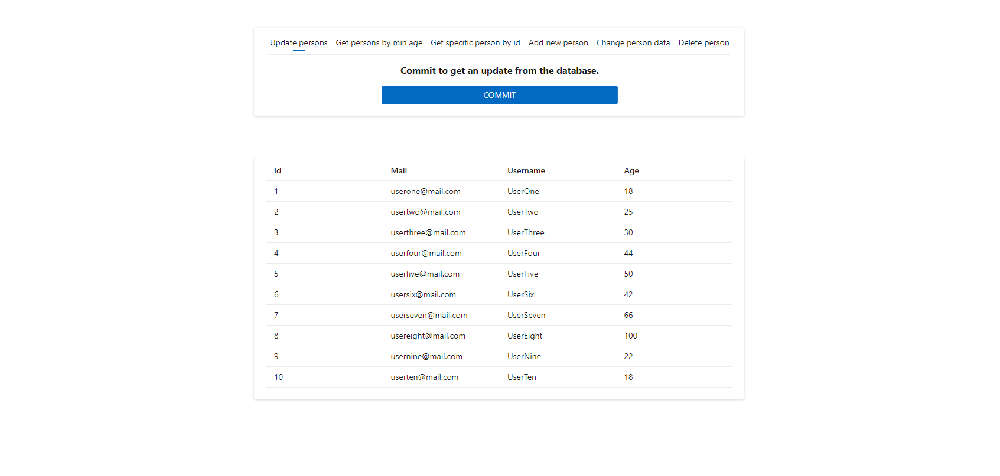

# Demo development environment for deploying microservices
The repo serves as the basis for a docker setup of a deployment architecture for microservices development. Web service (frontend) and API (backend) are implemented in .NET 6 as an example, but can be exchanged quickly and easily.
The readme describes a quick setup of the whole environment, as well as further details to reproduce this or a similar environment in the second part.


## What to expect?
A complete development environment with functional demo services (web frontend, API, database), a mocked backend (Swagger/OAS 2.0), reverse proxy/load balancer and monitoring (Grafana, Prometheus, Cadvisor). All services are containerized. The container composition and network configuration for the deployment steps local development, integration testing, end to end testing, staging and production are stored in separate docker-compose files.  
The specified ports refer to the production setup, which is described in the next step. In the setups of the other steps, the ports may differ (see detailed setup).

|  |
|:--:|
| *Reusing containers during deployment steps* |

|  |
|:--:|
| *Basic model of physical components and networking* |


### Webservice
A simple web page to retrieve, modify, add and delete users from a database.  

**Access via https://hostip**

|  |
|:--:|
| *Start page requesting all users* |

|  |
|:--:|
| *Adding a user (includes valid mail valdiation check)* |

### Backend
A minimal API implemented in NET (using swagger UI to show endpoint options), a MySQL (Maria) database with sample data already setup and a container running a mocked API (config file is pulled from repo and can be changed on runtime).

**None of the backendservices are directly accessible in the default setup. Check detailed setup section for further information on how to access these containers.**

|  |
|:--:|
| *Swagger UI of the API container* |

|  |
|:--:|
| *Demo request to /users endpoint showing the sample data* |

|  |
|:--:|
| *Same endpoint /users requested from mocked API container* |

|  |
|:--:|
| *Sample data in Maria DB container (mounted to data directory in db directory)* |

### Monitoring
To represent as realistic a scenario as possible, a stack for visualization (Grafana), time-based data collection (Prometheus) and container monitoring (CAdvisor) is provided for monitoring. The necessary configuration has already been done.

**Access:  
Grafana: http://hostip:3000, user: admin, pw: grafana  
CAdvisor: http://hostip:8080/docker/containername**

|  |
|:--:|
| *Network monitoring in Grafana. The dashboard shown is setup in the mounted dashboard.json file* |

|  |
|:--:|
| *Container monitoring in CAdvisor* |

## Setup a complete production environment
### Prerequisites
- Docker
- Docker Compose
- Docker service running
- Git

### Build
- ```cd``` or ```mkdir``` (to) a directory of your choice
- run ```git clone --recurse-submodules https://github.com/HansenBerlin/docker-demo-devenv.git``` from within that directory
- run ```cd docker-demo-devenv``` to change to the directory that was created by git
- run ```docker-compose up -d``` to start all services. This might take some time the first time you do this - depending on the images already available in your local registry and your internet connection.
- after everything is setup (you should see the prompt in your CLI again, without any errors being shown), open https://yourhostip in your browser
- if everything worked, you can access the services via the ports described in the previous step

dc: root, secret
grafana: admin, grafana
registry: testuser, testpassword


